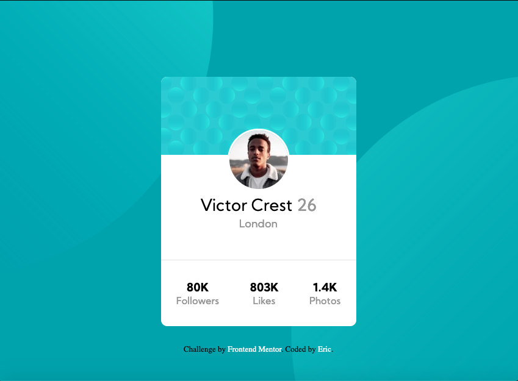

# Frontend Mentor - Profile card component solution

This is a solution to the [Profile card component challenge on Frontend Mentor](https://www.frontendmentor.io/challenges/profile-card-component-cfArpWshJ). Frontend Mentor challenges help you improve your coding skills by building realistic projects. 

## Table of contents

- [Overview](#overview)
  - [The challenge](#the-challenge)
  - [Screenshot](#screenshot)
  - [Links](#links)
- [My process](#my-process)
  - [Built with](#built-with)
  - [What I learned](#what-i-learned)
  - [Continued development](#continued-development)
  - [Useful resources](#useful-resources)
- [Author](#author)
- [Acknowledgments](#acknowledgments)

**Note: Delete this note and update the table of contents based on what sections you keep.**

## Overview

This is a profile component challenge. I used basic html and css to build this. I made use of media queries to position the circles in the background at different screen sizes. I am not completely satisfied with my work, but I put enough time into this and got out of it what I needed. There must be a better way to position the circles than the way that I did it. I kept adding media queries every hundred or so screen width pixels.

### The challenge

- Build out the project to the designs provided

### Screenshot

**Note: Delete this note and the paragraphs above when you add your screenshot. If you prefer not to add a screenshot, feel free to remove this entire section.**

### Links

- Solution URL: [Add solution URL here](https://wizardly-dubinsky-465c82.netlify.app/)
- Live Site URL: [Add live site URL here](https://wizardly-dubinsky-465c82.netlify.app/)

## My process

### Built with

- Semantic HTML5 markup
- CSS custom properties
- Flexbox
- Mobile-first workflow

### What I learned

The real challenge for me was the background circles. I don't think I came up with a successful method for approaching a problem like this, but I did learn that this is a weakness in my skillset and an area that I will need to focus on soon.

## Author

- Website - [Eric](https://www.digitalstoneage.tech)
- Frontend Mentor - [@eherod](https://www.frontendmentor.io/profile/eherod)

